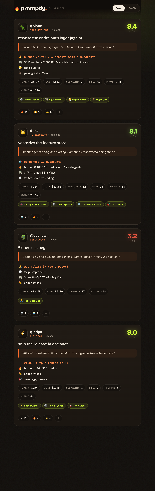

# 🔥 Promptly — Beli / Strava for Claude Code

Promptly turns your Claude Code sessions into **shareable social posts**. When a session
ends, it auto-generates a Beli-style card — *"🔥 burned 23,948,203 credits with 3 subagents,
😤 rage-quit 7×"* — scores it out of 10, roasts you, and drops it on a feed next to your friends'.

Zero manual export: it reads the session transcript Claude Code already writes to disk.



## Quick start

```bash
npm install
npm run init     # pick a handle + install the SessionEnd hook
npm run serve    # start your feed at http://localhost:4321 (auto-opens)
```

Then just code. When a Claude Code session ends, a post appears on your feed automatically and
you get a desktop notification. That's it.

## How it works

```
session ends → Claude Code fires the SessionEnd hook
            → hook detaches a worker (returns instantly, never blocks shutdown)
            → worker parses the transcript JSONL  (src/parser)
            → computes stats, cost, achievements    (deterministic)
            → asks headless `claude -p` for a 0–10 score + one-line roast (src/scoring)
            → POSTs the card to the local feed       (src/server)
            → 🔔 desktop notification
```

- **Hook** (`src/hook`) — thin, fire-and-forget. SessionEnd hook output is never shown and
  can't block, so all work happens in a detached `worker.ts`.
- **Parser** (`src/parser`) — reads `~/.claude/projects/**/<session>.jsonl` and computes tokens,
  **real cost** (verified Opus 4.7 pricing), active duration, subagents, tool usage, rage signals,
  night-owl detection, and more. **Stats only — no prompt or code text ever leaves your machine.**
- **Scoring** (`src/scoring`) — reuses your existing Claude Code auth via `claude -p` (no API key).
  Falls back to a deterministic score + templated roast if the LLM is slow/unavailable.
- **Backend** (`src/server`) — Express + a JSON-file store (`~/.promptly/data.json`). Serves the feed
  and the React web UI. Ships with seeded demo friends so the feed feels alive.
- **Web** (`web/`) — Vite + React feed and profile pages.

## What gets measured

**Stat callouts** (the punchy lines): credits burned, $ cost → Big Macs, rage-quits, subagents
commanded, night-owl peak hour, cache freeloading %, active coding time, files edited, prompts sent.

**Achievements** (auto-awarded badges): Token Tycoon, Big Spender, Subagent Whisperer, Rage Quitter,
Comeback Kid, Night Owl, Marathoner, Cache Freeloader, Bash Bro, Edit Warrior, Speedrunner,
Yak Shaver, The Polite One, The Closer, Man of Few Words.

**Beli-style score** — a 0–10 rating + a witty one-line roast, generated by an LLM.

## Auto-share threshold

By default **every** session posts. On the **Profile** page set an *auto-share threshold* — sessions
below that many tokens are saved as **drafts** you can publish manually, so the feed isn't spammed
with two-message throwaways.

## Privacy

Posts contain only derived numbers + the session's AI-generated title. No prompts, no code, no file
contents. The LLM scoring prompt receives only aggregate stats. Everything runs locally.

## Resilience

If the feed server isn't running when a session ends, the post is queued to `~/.promptly/outbox/`
and drained automatically the next time you `npm run serve`.

## Uninstall

Remove the `SessionEnd` entry that points at `src/hook/hook.ts` from `~/.claude/settings.json`.
Your data lives in `~/.promptly/` (safe to delete).

## Notes

- Requires Node 22+ (uses native TypeScript execution — no build step for the backend/hook).
- Local data: `~/.promptly/` (`config.json`, `data.json`, `outbox/`, `worker.log`).
- The hook installs into your **user** `~/.claude/settings.json` (preserving existing hooks), so it
  fires across all your projects.
# BeliForClaudeCode
